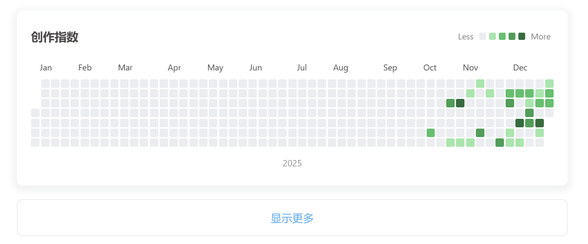

# hexo-butterfly-updates-heatmap (V2)

[English](./README.md) | 中文文档

这是一个专为 [Hexo Butterfly](https://github.com/jenrey/hexo-theme-butterfly) 主题设计（也兼容 **Hexo Fluid** 及其他主题）的**增强型热力图与时间轴插件**。

**V2 版本重大更新**：引入了**持久化历史记录**机制。
不再依赖 Markdown 文件中的 `updated` 字段，而是将每日的更新记录（数量与文章列表）永久固化在 JSON 文件中。即使您修改了文章文件，历史记录也永远不会丢失或被覆盖。



## V2 核心功能

1.  **持久化热力图**：自动记录每日更新数量，生成 GitHub 风格的贡献热力图。
2.  **永久时间轴**：替代主题自带的不稳定时间轴，提供一个**永久固化**的更新历史列表。
3.  **每日快照**：插件会在每天第一次运行时，自动将“昨天”的更新情况（文章标题、链接）存档到历史文件。
4.  **无感迁移**：支持从旧版（依赖 `updated` 字段）平滑过渡到新版（依赖 JSON 历史库）。

## 前置要求

1.  **Hexo 博客框架**
2.  **hexo-abbrlink 插件**（**必须**）：本插件的“持久化时间轴”功能严重依赖 `abbrlink` 字段来生成稳定的文章链接。如果您的文章没有 `abbrlink`，迁移脚本会跳过这些文章。
    *   安装：`npm install hexo-abbrlink --save`
    *   配置：请确保 `_config.yml` 中已启用 abbrlink。

## 安装方法

1.  下载本仓库代码（两种方式）
    -   **方式一**：下载 ZIP 包解压，将 `hexo-butterfly-updates-heatmap` 文件夹放入您的博客根目录（与 `source`, `themes` 同级）。
    -   **方式二**：在博客根目录下运行：
        ```bash
        git clone https://github.com/luoyinhui/hexo-butterfly-updates-heatmap.git
        ```
2.  安装依赖：
    ```bash
    npm install moment
    ```

## 配置说明

在您的 `_config.butterfly.yml`（或者站点 `_config.yml`）中添加以下配置：

```yaml
updates_settings:
  enable: true
  title: '创作指数'       # 热力图左上角显示的标题
  color_scheme: 'green'   # 主题色可选: green, blue, pink, red, orange, purple
  empty_history_msg: '博客还没有满1岁呢～～' # 当没有跨年历史数据时显示的提示语
  thresholds: [1, 2, 3, 4] # (可选) 颜色分级阈值。例如 [1, 2, 3, 4] 代表 >=1篇为Lv1...
```

## 使用方法

### 1. 渲染热力图
在任意 Markdown 文章（推荐新建 `source/updates/index.md`）中，插入：
```markdown

```

### 2. 渲染更新时间轴
在同一文件中，插入以下标签即可显示永久固化的历史更新列表：
```markdown

```

**推荐的页面结构 (`source/updates/index.md`)**：
```markdown
---
title: 更新
date: 2025-12-09 00:00:00
type: updates
layout: page
---



```

## 迁移指南 (从 V1 过渡到 V2)

如果您之前使用旧版插件（依赖 Markdown 文件的 `updated` 字段），请按照以下步骤升级，以获得数据持久化保护：

1.  **备份**：请先备份您的博客源文件。
2.  **替换文件**：用新版插件文件夹替换旧版。
3.  **运行迁移工具**：
    在博客根目录下打开终端，运行：
    ```bash
    node hexo-butterfly-updates-heatmap/scripts/migrate_v1_to_v2.js
    ```
    **脚本作用**：
    *   **热力图迁移**：如果新插件目录中包含您旧版的 `lib/history_data.json`，脚本会保留它。如果缺失，脚本会根据您现有的文章（updated/date）自动重建热力图数据。
    *   **时间轴迁移**：扫描所有文章，提取时间戳生成永久的 `lib/history_timeline.json`。
    *   (可选) 可以在脚本中配置 `REMOVE_UPDATED_FIELD = true` 来自动清理 MD 文件（默认关闭）。
    
    > **关于 `updated` 字段**：
    > `updated` 并不是 Hexo 默认强制生成的字段。如果您的文章中没有这个字段，脚本会自动回退使用 `date`（创建时间）作为初始历史记录。因此，无论您之前是否手动维护过 `updated`，本迁移脚本都能正常工作。

4.  **更新页面**：修改您的更新页 Markdown，使用上述的新标签 (``) 替换原来的主题自带列表。

## 文件结构说明
*   `index.js`: 插件核心逻辑。
*   `lib/history_data.json`: 存储热力图的每日计数（只存数量）。
*   `lib/history_timeline.json`: 存储每日更新的文章详情（标题、链接、日期）。**这是您的核心资产，请勿误删。**
*   `lib/last_run.json`: 记录最后一次运行日期，用于触发每日快照。

## 注意事项

本插件会将历史数据存储在 `lib/` 目录下的 JSON 文件中。
*   如果您是直接从 GitHub 克隆本仓库，该目录默认是干净的。
*   **如果您是下载了作者或其他人的完整插件包（包含 `lib/history_*.json`）**：
    *   请在使用前**删除 `lib/` 目录下的所有 JSON 文件**，否则您会继承别人的更新历史记录。
    *   删除后，运行上述的迁移脚本，即可为您生成属于您自己的历史记录。
*   插件在第一次运行时会自动生成新的空白 JSON 文件，开始记录您的专属历史.

## 开源协议

MIT
